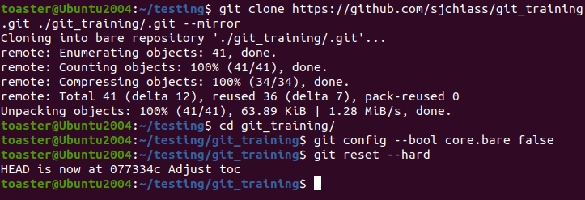

# Git training <!-- omit in toc -->

- [Start here :bulb:](#start-here-bulb)
  - [How to copy this to your computer](#how-to-copy-this-to-your-computer)
  - [Caution](#caution)
  - ["Please tell me who you are."](#please-tell-me-who-you-are)
  - [View the raw files](#view-the-raw-files)
- [Topics](#topics)
  - [Merging branches with and without conflicts](#merging-branches-with-and-without-conflicts)
    - [Documentation](#documentation)
    - [Best of Stack Overflow](#best-of-stack-overflow)
    - [Quiz: simple merge :thinking:](#quiz-simple-merge-thinking)
      - [Setup](#setup)
      - [Story](#story)
      - [Goal](#goal)
      - [Solutions](#solutions)
    - [Quiz: merge conflicts :thinking:](#quiz-merge-conflicts-thinking)
      - [Setup](#setup-1)
      - [Story](#story-1)
      - [Goal](#goal-1)
      - [Solutions](#solutions-1)

# Start here :bulb:

## How to copy this to your computer

This repository includes its own examples, which are used in the exercises below. In order to get all of this on your computer, you need to use these commands to do a deep clone of the repository ([Stack Overflow](https://stackoverflow.com/a/7216269)):

```
git clone https://github.com/sjchiass/git_training.git ./git_training/.git --mirror
cd git_training/
git config --bool core.bare false
git reset --hard
```



The repository with all of its extras will appear in a folder called `git_training`.

Don't worry about breaking anything! You can always delete the `git_training` folder and `clone` yourself a replacement.

## Caution

Avoid downloading the zip directly! Zip download will only download files, not the git repository. You will not have all of the git extras including branches and history!


## "Please tell me who you are."

If git asks you who you are, you haven't set up your profile for the repo. This is normal.

If you're using git for both work and hobby, it's not a good idea to set a global configuration. You might accidentally push to your company's repositories with your personal information.

For these exercises, there's no problem in creating a fake local profile:

```
git config user.email "someone@example.com" && git config user.name "someone"
```

The settings will only be applied to your current repository.

## View the raw files

This repository includes branches that are used for the exercises below. These branches are also available as folders in the default branch of this repository.

You can also view these branches in the [raw_branches subfolder](./raw_branches).

If you wanted to recreate one of these branches,

  * use `git checkout -b my_new_branch` to start a new branch
  * delete everything in the repo (except the `.git` folder)
  * paste the contents of the raw folder
  * then `git commit -m "Made new branch"`

# Topics

## Merging branches with and without conflicts

When you're collaborating with others on a git repository, you'll each be working in branches and eventually you'll want to merge them together.

If you've been working on separate pieces of code, git will keep both of your changes and everything will be good.

If you've been working on the same code, you will have to choose which pieces of code to keep and which to discard. This is known as resolving a merge conflict.

### Documentation

| GitHub guides | Atlassian tutorials | git-scm manual | Other blogs/guides |
|---------------|---------------------|----------------|--------------------|
| [About merge conflicts](https://docs.github.com/en/free-pro-team@latest/github/collaborating-with-issues-and-pull-requests/about-merge-conflicts) | [Git Merge](https://www.atlassian.com/git/tutorials/using-branches/git-merge) | [3.2 Git Branching - Basic Branching and Merging](https://git-scm.com/book/en/v2/Git-Branching-Basic-Branching-and-Merging) | [Creating and Merging Conflicts on Git Branches](https://codeforphilly.github.io/decentralized-data/tutorials/actually-using-git/lessons/conflicting-branches/) |

### Best of Stack Overflow

  * [What is git fast forwarding](https://stackoverflow.com/questions/29673869/what-is-git-fast-forwarding)
  * [How to resolve conflicts in a text editor and other merge advice](https://stackoverflow.com/questions/161813/how-to-resolve-merge-conflicts-in-git-repository/7589612#7589612)

### Quiz: simple merge :thinking:

#### Setup

This repository has two branches: `merge_init` and `merge_a`.

#### Story

You wrote an example script in base R on `merge_init` and then forgot about it. One of your colleagues decided to improve the script in the `merge_a` branch. They've let you know that their work is done and you can merge the changes whenever you want. As the project leader, you want to incorporate these changes to the main branch.

#### Goal

Merge `merge_a` onto `merge_init`.

#### Solutions

[See solutions](./merge_solutions.md)

### Quiz: merge conflicts :thinking:

#### Setup

This repository has three branches: `merge_init`, `merge_a` and `merge_b`.

#### Story

You wrote an example script in base R on `merge_init` and then forgot about it. Two team members decided separately to convert the code to tidyverse, on branches `merge_a` and `merge_b`. They approached the task differently, and their solutions have different strengths. As the project leader, you are in charge of choosing what to keep.

#### Goal

Merge `merge_a` and `merge_b` together while choosing the pieces of code you like most.

Hint: here is how you would start this on the command-line, assuming you're already in the repo folder

```
git checkout merge_a
git merge merge_b
```


#### Solutions

[See solutions](./merge_conflicts_solutions.md)
