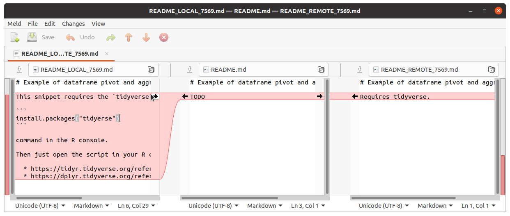
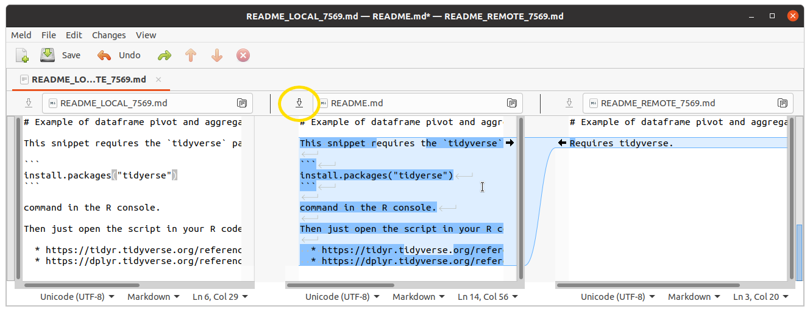
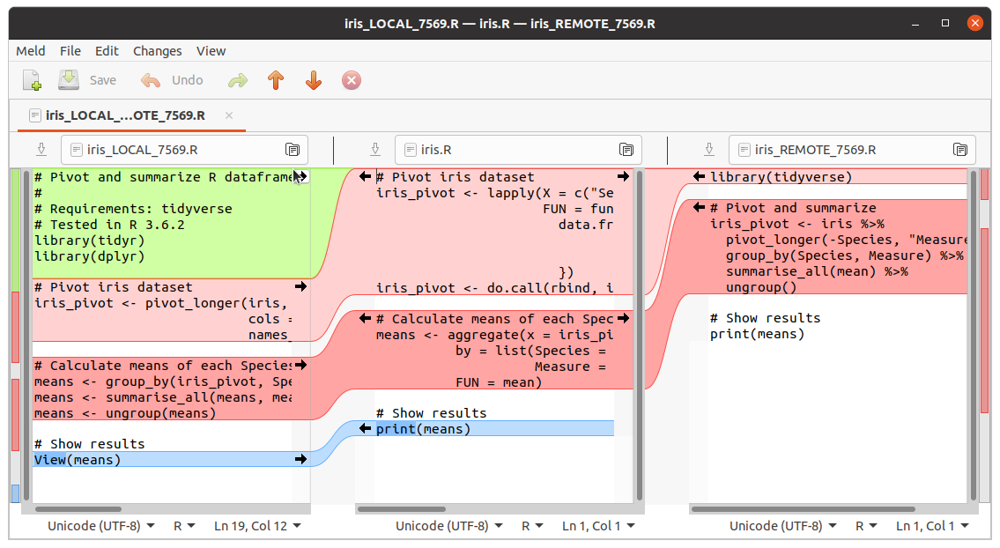
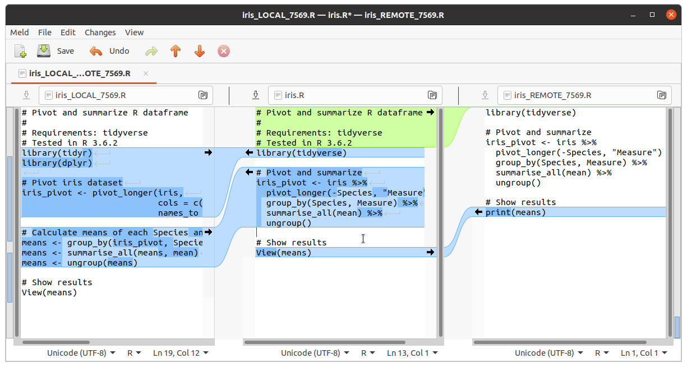

# Solutions for merge conflict quiz <!-- omit in toc -->

- [FAQ](#faq)
- [Validating a solution: how to verify your success](#validating-a-solution-how-to-verify-your-success)
- [Solutions](#solutions)
  - [Command-line](#command-line)
  - [Command-line with a different diff style](#command-line-with-a-different-diff-style)
  - [`git mergetool`  on Linux](#git-mergetool--on-linux)

## FAQ

  * Why did this merge not happen automatically?
    * If `merge_a` and`merge_b` were in a family tree, they would not be parent and child but rather siblings. Git does not know which to favour so it lets you decide.
  * Why did some parts of the code merge automatically?
    * The merge is done line-by-line. If one branch doesn't change a line but the other does, the changed line is the direct descendant of the original. Git accepts it automatically.
    * You can see this happen in the last line of `iris.R`. The `View()` of `merge_a` is accepted automatically because `merge_b` did not change the `print()` call.
  * Does the direction of the merge matter?
    * Not in this case, but it may matter in others. Whichever branch is the most "mainstream" one ought to be the target. You always want to merge your feature branch into your main branch.

## Validating a solution: how to verify your success

Let's check what the commit tree looks like before we do the merge.

```console
|   
| * commit 622e5e469ae056f0bafb3c5957a9adaa61862676 (HEAD -> merge_a)
| | Author: Sebastien Chiasson <sebastien.chiasson@canada.ca>
| | Date:   Wed Dec 2 11:32:27 2020 -0500
| | 
| |     Fix wording in README
| | 
| * commit 6cf09021b390cb451c2789b979c6693fb8670f12
| | Author: Sebastien Chiasson <sebastien.chiasson@canada.ca>
| | Date:   Wed Dec 2 11:21:41 2020 -0500
| | 
| |     Create merge_a
| |   
| | * commit f33a8c8c8e9c657ac6ea4bece6be4deb635f83d4 (merge_b)
| | | Author: Sebastien Chiasson <sebastien.chiasson@canada.ca>
| | | Date:   Wed Dec 2 11:29:47 2020 -0500
| | | 
| | |     Start working on README
| | | 
```

Once the merge is complete, the two branches will combine together, and `merge_a` will continue on. Below is the commit tree, slightly modified for clarity.

```console
* commit d30164544df34e237d34a0662abf30cd5fef77be (HEAD -> merge_a)
| Author: someone <someone@example.com>
| Date:   Mon Dec 7 10:56:48 2020 -0500
| 
|     Make a test commit
| 
*   commit 275c2c7c53a1465418a76cf14e0d10ffa283f5c2
|\  Merge: 622e5e4 f33a8c8
| | Author: someone <someone@example.com>
| | Date:   Mon Dec 7 10:53:03 2020 -0500
| | 
| |     Merge merge_b onto merge_a, resolve conflicts
| | 
| * commit d25b5fcfc97172d917c23835bef8465a1ac370eb (merge_b)
| | Author: Sebastien Chiasson <sebastien.chiasson@canada.ca>
| | Date:   Wed Dec 2 11:23:04 2020 -0500
| | 
| |     Make merge_b branch
| | 
* | commit 6cf09021b390cb451c2789b979c6693fb8670f12
|/  Author: Sebastien Chiasson <sebastien.chiasson@canada.ca>
|   Date:   Wed Dec 2 11:21:41 2020 -0500
|   
|       Create merge_a
| 
```
## Solutions

### Command-line

Merge conflicts on the command-line are indicated by markers in text files. In this short demo you'll see examples of these.

First, start by switching to your target branch.

```console
$ git checkout merge_a
Switched to branch 'merge_a'
```

Then start the merge with the source branch.

```console
$ git merge merge_b
Auto-merging iris.R
CONFLICT (content): Merge conflict in iris.R
Auto-merging README.md
CONFLICT (content): Merge conflict in README.md
Automatic merge failed; fix conflicts and then commit the result.
```

Git has told you which files have conflicts. You can inspect these in a text editor, for example `nano iris.R`.

The file uses markers
  * `<<<<<<< HEAD` is the start of your current branch `merge_a`.
  * `=======` marks the end of `merge_a` and the start of `merge_b`. It's a separator.
  * `>>>>>>> merge_b` marks the end of `merge_b`, which is the source branch.

```
<<<<<<< HEAD
# Pivot and summarize R dataframe
#
# Requirements: tidyverse
# Tested in R 3.6.2
library(tidyr)
library(dplyr)

# Pivot iris dataset
iris_pivot <- pivot_longer(iris,
                           cols = c("Sepal.Length", "Sepal.Width", "Petal.Length", "Petal.Width"),
                           names_to = "Measure")

# Calculate means of each Species and Measure combination
means <- group_by(iris_pivot, Species, Measure)
means <- summarise_all(means, mean)
means <- ungroup(means)
=======
library(tidyverse)

# Pivot and summarize
iris_pivot <- iris %>%
  pivot_longer(-Species, "Measure") %>%
  group_by(Species, Measure) %>%
  summarise_all(mean) %>%
  ungroup()
>>>>>>> merge_b

# Show results
View(means)
```

You get to choose the solution by just editing the file in your text editor. Get rid of all the markers and tweak the file until you're satisfied.

```
# Pivot and summarize R dataframe
#
# Requirements: tidyverse
# Tested in R 3.6.2
library(tidyverse)

# Pivot and summarize
iris_pivot <- iris %>%
  pivot_longer(-Species, "Measure") %>%
  group_by(Species, Measure) %>%
  summarise_all(mean) %>%
  ungroup()

# Show results
View(means)
```

Do the same for `README.md`. When you're done, treat this as any other commit.

:rotating_light: Just like any other commit, *test your code before you commit!* :rotating_light:

```console
$ git add .
$ git commit -m "Merge of merge_b into merge_a"
[merge_a 7b29e7d] Merge of merge_b into merge_a
```

If you look at the commit graph, you'll see that the two branches have fused together into a new commit.

### Command-line with a different diff style

As seen in [this Stack Overflow post](https://stackoverflow.com/questions/161813/how-to-resolve-merge-conflicts-in-git-repository/7589612#7589612), you can use a different style for the markers.

```console
$ git config merge.conflictstyle diff3
```

Then

```console
$ git merge merge_b
Auto-merging iris.R
CONFLICT (content): Merge conflict in iris.R
Auto-merging README.md
CONFLICT (content): Merge conflict in README.md
Automatic merge failed; fix conflicts and then commit the result.
```

There are now different markers
  * `<<<<<<< HEAD` is the start of your current branch `merge_a`.
  * `||||||| acf402a` is the start of the common ancestor `merge_init`
  * `=======` marks the end of `merge_init` and the start of `merge_b`. It's a separator.
  * `>>>>>>> merge_b` marks the end of `merge_b`, which is the source branch.

Below is an abridged version of `iris.R`. You can see how you're able to see the three different ways of calculating the means.

```
<<<<<<< HEAD
# Calculate means of each Species and Measure combination
means <- group_by(iris_pivot, Species, Measure)
means <- summarise_all(means, mean)
means <- ungroup(means)
||||||| acf402a
# Calculate means of each Species and Measure combination
means <- aggregate(x = iris_pivot$Value,
          by = list(Species = iris_pivot$Species,
                    Measure = iris_pivot$Measure),
          FUN = mean)
=======
# Pivot and summarize
iris_pivot <- iris %>%
  pivot_longer(-Species, "Measure") %>%
  group_by(Species, Measure) %>%
  summarise_all(mean) %>%
  ungroup()
>>>>>>> merge_b

# Show results
View(means)
```
### `git mergetool`  on Linux

Once you've started your merge with

```console
$ git merge merge_b
Auto-merging iris.R
CONFLICT (content): Merge conflict in iris.R
Auto-merging README.md
CONFLICT (content): Merge conflict in README.md
Automatic merge failed; fix conflicts and then commit the result.
```

You can use the command `git mergetool` to automatically open a GUI to help you. You can configure git to always use your tool of choice, but it will use whatever it can find by default. `sudo apt install meld` to get meld in Ubuntu.

```console
$ git mergetool

This message is displayed because 'merge.tool' is not configured.
See 'git mergetool --tool-help' or 'git help config' for more details.
'git mergetool' will now attempt to use one of the following tools:
meld opendiff kdiff3 tkdiff xxdiff tortoisemerge gvimdiff diffuse diffmerge ecmerge p4merge araxis bc codecompare smerge emerge vimdiff
Merging:
README.md
iris.R

Normal merge conflict for 'README.md':
  {local}: modified file
  {remote}: modified file
Hit return to start merge resolution tool (meld): 

Normal merge conflict for 'iris.R':
  {local}: modified file
  {remote}: modified file
Hit return to start merge resolution tool (meld):
```
In meld you can click the arrows to move segments of the file in whatever direction you want. To the left is the source branch, in the middle is the original branch (the common ancestor), and to the right is the target branch.



Once you're done, click the little save button.



A more complicated merge conflict looks like this:



Each pane in meld is its own text editor. You can copy-paste segments from any of the panes to get the code looking right.

Notice the parts of the left and right panes that are uncoloured: these are the segments that we're keeping in the merge.



**Note**: when using a mergetool, git will keep `.orig` files in the folder. These are backups of the originals. Either delete these files yourself or add `.orig` to your `.gitignore`.

You can then commit the merge as you do normally:

```console
$ git commit -m "Merge files with meld"
[merge_a aec170b] Merge files with meld
```