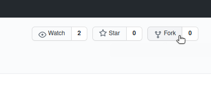
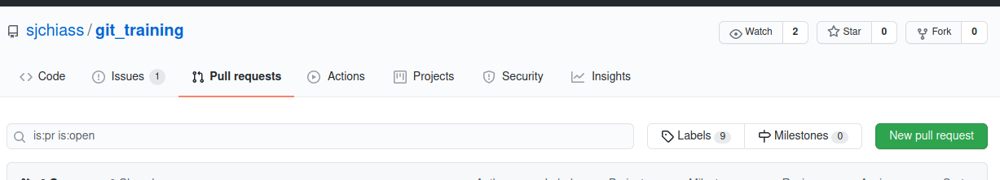
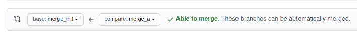

# Solutions for merge quiz <!-- omit in toc -->

- [FAQ](#faq)
- [Validating a solution: how to verify your success](#validating-a-solution-how-to-verify-your-success)
- [Solutions](#solutions)
  - [Using GitHub](#using-github)
  - [The command line](#the-command-line)

## FAQ

  * Why did this merge happen automatically?
    * Git was able to fast-forward this merge because `merge_a` is a direct descendant of `merge_init`. Because `merge_a` is just a later version of `merge_init`, the merge is unambiguous.
    * Another way of thinking about this is that `merge_a` is not really a branch of `merge_init`. If this were a tree, these would both be part of the trunk.
  * Does the direction of the merge matter?
    * Yes. Git won't let you merge `merge_init` (source) into `merge_a` (target). Because `merge_a` is a direct descendant of `merge_init`, Git will say that there's nothing to do (`Already up to date.`).

## Validating a solution: how to verify your success

This is a simple fast-forward merge, so `merge_init` and `merge_a` ought to combine together in the Git history.

Below is what the commit tree looks like before the merge. `merge_init` is behind `merge_a`.

```console
|   
| * commit 622e5e469ae056f0bafb3c5957a9adaa61862676 (merge_a)
| | Author: Sebastien Chiasson <sebastien.chiasson@canada.ca>
| | Date:   Wed Dec 2 11:32:27 2020 -0500
| | 
| |     Fix wording in README
| | 
| * commit 6cf09021b390cb451c2789b979c6693fb8670f12
| | Author: Sebastien Chiasson <sebastien.chiasson@canada.ca>
| | Date:   Wed Dec 2 11:21:41 2020 -0500
| | 
| |     Create merge_a
| |   
| | * commit f33a8c8c8e9c657ac6ea4bece6be4deb635f83d4 (merge_b)
| | | Author: Sebastien Chiasson <sebastien.chiasson@canada.ca>
| | | Date:   Wed Dec 2 11:29:47 2020 -0500
| | | 
| | |     Start working on README
| | | 
| | * commit d25b5fcfc97172d917c23835bef8465a1ac370eb
| |/  Author: Sebastien Chiasson <sebastien.chiasson@canada.ca>
| |   Date:   Wed Dec 2 11:23:04 2020 -0500
| |   
| |       Make merge_b branch
| | 
| * commit acf402a6d7d0d28453f9e9fdf24f0f93e4305e80 (merge_init)
|/  Author: Sebastien Chiasson <sebastien.chiasson@canada.ca>
|   Date:   Wed Dec 2 11:20:34 2020 -0500
|   
|       Initialize merge example
| 
```

Here is what a successful fast-forward looks like: `merge_init` has caught up to to `merge_a`. The two branches are at the same place.

```console
|   
| * commit 622e5e469ae056f0bafb3c5957a9adaa61862676 (HEAD -> merge_init, merge_a)
| | Author: Sebastien Chiasson <sebastien.chiasson@canada.ca>
| | Date:   Wed Dec 2 11:32:27 2020 -0500
| | 
| |     Fix wording in README
| | 
```

To further confirm that this all works, try a test commit on `merge_init`. It should continue on from`merge_a`, leaving it behind. `merge_init` has all of `merge_a`'s code and carries on its legacy.

```console
* commit cc974ce92f654d39be79e3136bfae65682752543 (HEAD -> merge_init)
| Author: someone <someone@example.com>
| Date:   Mon Dec 7 10:36:43 2020 -0500
| 
|     test commit
| 
* commit 622e5e469ae056f0bafb3c5957a9adaa61862676 (merge_a)
| Author: Sebastien Chiasson <sebastien.chiasson@canada.ca>
| Date:   Wed Dec 2 11:32:27 2020 -0500
| 
|     Fix wording in README
| 
```

## Solutions

### Using GitHub

If you have a GitHub account, you can merge this code with a fork. There is no need to copy any code to your computer.

First, start by creating a fork of the `git_training` repository. You can find the fork button at the top-right.



GitHub will ask you where to fork the project. If you fork it to your personal workspace, you'll have a new personal copy of the `git_training` repository.

Next, ask GitHub to start a new pull request. Click on the "Pull requests" tab and you will see bright green button for a "New pull request".



On the new pull request screen, you can select the branches to merge. In the case of `merge_init <- merge_a`, the merge is automatic!



### The command line

Using `merge` on the command line will result in a fast-forward merge, which is automatic.

Start by switching to the "base" branch, the branch whose name you want to keep.

```console
$ git checkout merge_init
Switched to branch 'merge_init'
```

Next you can use the merge command to complete the merge.

```console
$ git merge merge_a
Updating acf402a..622e5e4
Fast-forward
 README.md | 13 ++++++++++++-
 iris.R    | 26 ++++++++++++++------------
```
 
The merge is now complete.

```console
$ git status
On branch merge_init
nothing to commit, working tree clean
```
